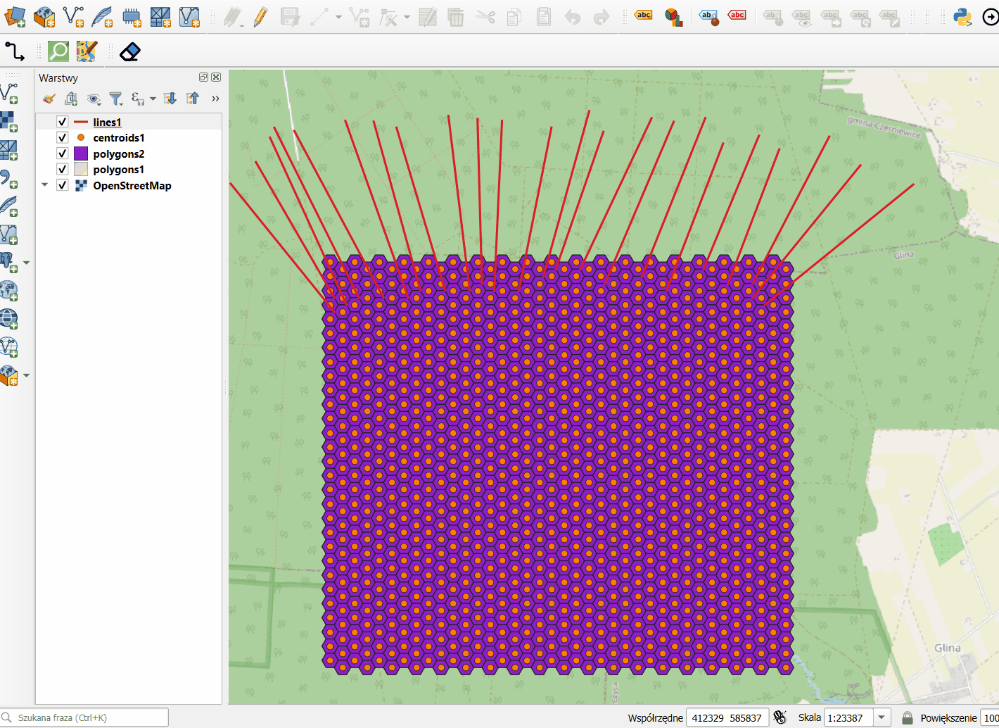

# Vector Rubber

Vector Rubber is a QGIS plugin designed to quickly delete multiple features from multiple vector layers simultaneously using a rectangular selection tool.

## Overview

Working with multiple vector layers usually requires selecting active layers one by one, selecting features, and deleting them individually. **Vector Rubber** streamlines this process by allowing you to define a list of target layers and delete features from all of them at once with a single sweep of the mouse.

## Key Features

*   **Multi-layer support:** Select unlimited vector layers to modify simultaneously.
*   **Drag-to-delete:** Use a rectangular selection tool to identify and remove features.
*   **Safety first:**
    *   **Undo/Redo support:** All deletions are wrapped in edit commands, allowing you to easily revert changes using the plugin's "Undo" button or QGIS native undo.
    *   **Editing mode:** The plugin automatically handles editing modes. If a layer is not editable, the plugin starts editing, performs the deletion, and leaves it open for you to save or discard changes.
*   **User-friendly Interface:** Simple dock widget integrated into the QGIS workspace.

## How to Use

1.  **Open the Plugin:**
    *   Go to the Plugins menu or toolbar and click the Vector Rubber icon. The Vector Rubber dock widget will appear.

2.  **Select Target Layers:**
    *   The widget lists all available vector layers in your project.
    *   Check the boxes next to the layers you want to modify.
    *   Use "Select all vector layers" or "Uncheck all" for quick selection.

3.  **Activate the Tool:**
    *   Click the **"Confirm selected vector layers"** button. This locks your selection and activates the map tool.

4.  **Delete Features:**
    *   Click and drag on the map canvas to draw a rectangle.
    *   All features inside the rectangle (on the checked layers) will be deleted immediately.
    *   *Note: This operation modifies the data. Ensure you have backups if working with critical datasets.*

5.  **Undo or Save:**
    *   **Undo:** If you made a mistake, click the **"Undo"** button in the plugin panel to revert the last deletion action.
    *   **Save changes and finish:** When you are done, click this button to save edits for all modified layers and deactivate the tool.

## Installation

### From the QGIS Plugin Repository
1.  Open QGIS.
2.  Go to `Plugins` > `Manage and Install Plugins...`.
3.  Search for "Vector Rubber".
4.  Click `Install Plugin`.

### Manual Installation (from ZIP)
1.  Download the plugin source code and compress it into a `.zip` file (if it is not already zipped).
2.  Open QGIS.
3.  Go to `Plugins` > `Manage and Install Plugins...`.
4.  Click on the **"Install from ZIP"** tab in the left sidebar.
5.  Click the browse button (`...`), select your `.zip` file, and click **"Install Plugin"**.
6.  The plugin should now be available in your toolbar or plugins menu.

## License

GNU General Public License v2.0 (GPLv2)